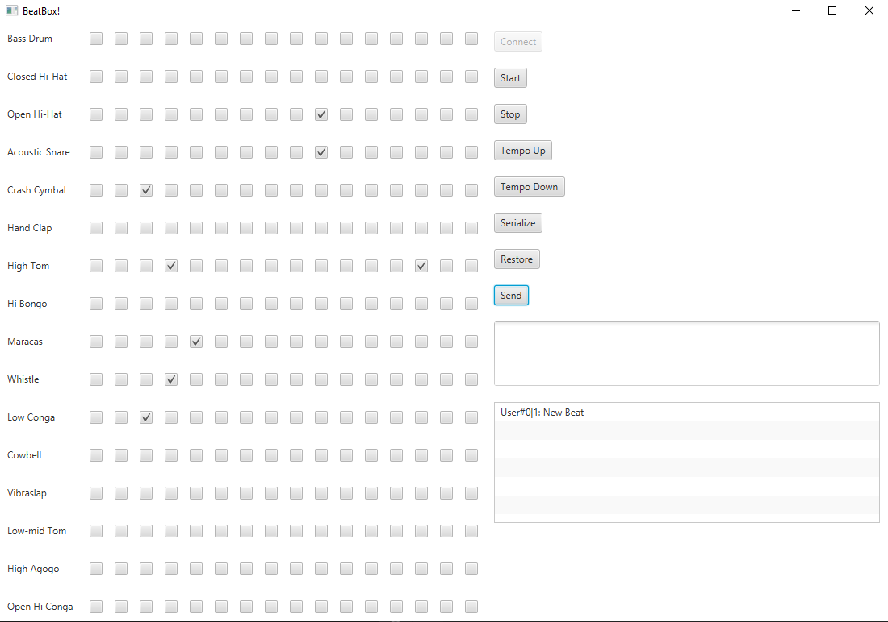

# basic-beat-box

Beat Box proposed in the last chapters of Head First Java made with JavaFX.

The program lets you create a beat using the Java Music API that can be played, stopped, sped up, slowed down, saved to a file and loaded from a file. It uses multithreading to deal with networking which enables sending beats through a server.

